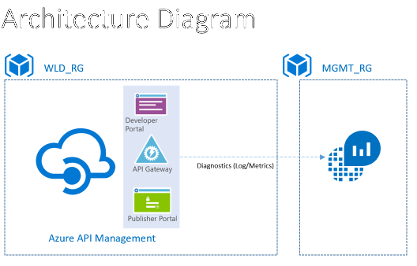
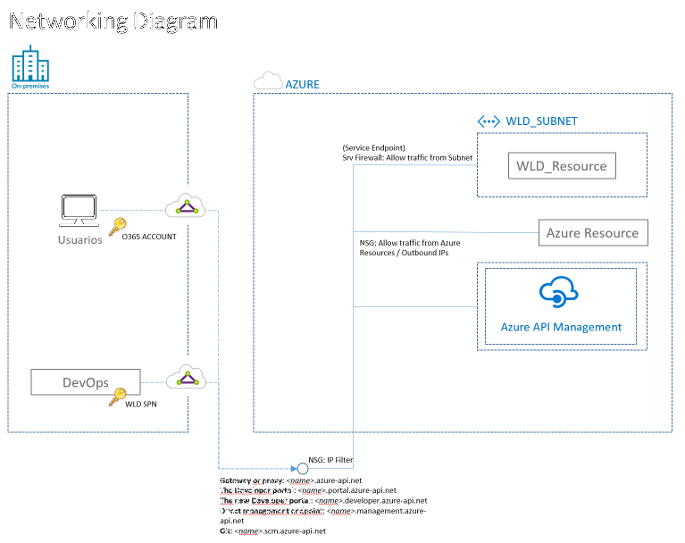

# **Azure API Management**

## Overview
**IMPORTANT** 
If you want to run this module it is an important requirement to specify the azure provider version, you must set the azure provider version and the terraform version in version.tf file.

This module has been certified with the versions:

| Terraform version | Azure version |
| :-----: | :-----: |
| 1.8.5 | 3.110.0 |

 
### Acronym
Acronym for the product is **ams**.

## Description

API Management is a way to create consistent and modern API gateways for existing back-end services. It is a managed service for publishing catalogs of APIs, to promote reuse and discoverability. API Management consists of two related components:

    API gateway. The API gateway accepts HTTP/HTTPS calls and routes them to the backend.

    Developer portal. Each instance of Azure API Management provides access to a developer portal. This portal gives your developers access to documentation and code samples for calling the APIs. You can also test APIs in the developer portal.

You can also import existing web services by importing OpenAPI (Swagger) specifications or importing SOAP APIs from WSDL specifications.

The API gateway helps to decouple front-end clients from the back end, as it can be used to take any backend and launch a full-fledged API program based on it. For example, it can rewrite URLs, or transform requests before they reach the backend. It also handles many cross-cutting concerns such as authentication, cross-origin resource sharing (CORS) support, and response caching.

To use API Management, administrators create APIs. Each API consists of one or more operations, and each API can be added to one or more products. To use an API, developers subscribe to a product that contains that API, and then they can call the API's operation, subject to any usage policies that may be in effect.

The system is made up of the following components:

    The API gateway is the endpoint that:
        Accepts API calls and routes them to your backends.
        Verifies API keys, JWT tokens, certificates, and other credentials.
        Enforces usage quotas and rate limits.
        Transforms your API on the fly without code modifications.
        Caches backend responses where set up.
        Logs call metadata for analytics purposes.

    The Azure portal is the administrative interface where you set up your API program. Use it to:
        Define or import API schema.
        Package APIs into products.
        Set up policies like quotas or transformations on the APIs.
        Get insights from analytics.
        Manage users.

    The Developer portal serves as the main web presence for developers, where they can:
        Read API documentation.
        Try out an API via the interactive console.
        Create an account and subscribe to get API keys.
        Access analytics on their own usage.

> **IMPORTANT**: If you want to run this module with a specific version of the Azure provider, it must be established by the client in its versions.tfvars file.<br><br>If it is required to fix the terraform version, proceed in the same way as with the azure provider.<br><br>This module has been certified with the version of azure provider 3.90.0 and with the version of terraform 1.7.1.

|Configuration|Description|
|:--:|:--:|
|Supported Services|Publish APIs, APIs routing & endpoint, API policies, APIs cache|
|Supported Protocols|HTTPS|
|Authentication|Azure AD RBAC model should be used to access resources. SAS token access can be applied only for direct access API calls, you cannot use it for API calls to Azure Resource Manager.|

## Public Documentation
[Azure API Management Key Concepts](https://docs.microsoft.com/en-us/azure/api-management/api-management-key-concepts)
[Azure API Management REST API Authentication](https://docs.microsoft.com/en-us/rest/api/apimanagement/apimanagementrest/azure-api-management-rest-api-authentication)
[How to use API Manegement with Virtual Networks](https://docs.microsoft.com/en-us/azure/api-management/api-management-using-with-vnet)
[Using Azure API Management service with an internal Virtual Network](https://docs.microsoft.com/en-us/azure/api-management/api-management-using-with-internal-vnet)

## Dependencies
The following resources must exist before the deployment can take place:
Resources given by the Cloud Competence Center that need to be in place:
- Azure Subscription
- Resource Group
- Azure Active Directory Tenant.
- The running SPN must have the Contributor role in the subscription.
- Log Analytics Workspace (formerly OMS) for health logs and metrics.
- Ssl certs if custom domains are activated.
- An Azure Key Vault where custom domain(s) certs are stored.
- A deployment Service Principal with owner permissions on the resource group
- A Virtual Network and a Subnet from where to access the product that meets the requirements set out [here](https://aka.ms/apimvnet)
- When an API Management service is deployed in a virtual network, a list of ports defined in the network section are used and need to be opened.
- Whether or not public endpoint access is allowed for this API Management service. Value is optional but if passed in, must be 'Enabled' or 'Disabled'. If 'Disabled', private endpoints are the exclusive access method. Default value is 'Enabled'
- The sku will be always Premium to permit subnet injection. See Network Limitations below.
- All protocol settings are disable by default.
- User, group, or service principal used to deploy must have contributor rol over the subscription.
- Redis cache service

**IMPORTANT** 
* Some resources, such as secret or key, can support a maximum of 15 tags.
* Availability zones are only supported on the premium tier and need the network type to be internal. The number of units must be a multiple of the number of availability zones

## Architecture example:


## Networking
### Network topology 

### List of Ports
When an API Management service instance is hosted in a VNET, the ports in the following table are used.
|Source - Destination Port(s)| Direction | Transport protocol | Service Tags Source - Destination | Purpose  |Virtual Network type |
|:--:|:--:|:--:|:--:|:--:|:--:|
| 80, 443| Inbound | TCP | INTERNET - VIRTUAL_NETWORK| Client communication to API Management| External |
| 3443| Inbound| TCP | ApiManagement - VIRTUAL_NETWORK | Management endpoint for Azure portal and Powershell| External & Internal |
| 80, 443| Outbound| TCP | VIRTUAL_NETWORK - Storage| **Dependency on Azure Storage**| External & Internal |
| 80, 443| Outbound| TCP | VIRTUAL_NETWORK - AzureActiveDirectory| Azure Active Directory (where applicable)| External & Internal |
|1433| Outbound| TCP | VIRTUAL_NETWORK - SQL| **Access to Azure SQL endpoints**| External & Internal |
| 5672| Outbound| TCP | VIRTUAL_NETWORK - EventHub| Dependency for Log to Event Hub policy and monitoring agent| External & Internal |
| 445| Outbound| TCP | VIRTUAL_NETWORK - Storage| Dependency on Azure File Share for GIT| External & Internal |
| 1886| Outbound| TCP | VIRTUAL_NETWORK - INTERNET| Needed to publish Health status to Resource Health| External & Internal |
| 443| Outbound| TCP | VIRTUAL_NETWORK - AzureMonitor| Publish Diagnostics Logs and Metrics| External & Internal |
| 25| Outbound| TCP | VIRTUAL_NETWORK - INTERNET| Connect to SMTP Relay for sending e-mails| External & Internal |
| 587| Outbound| TCP | VIRTUAL_NETWORK - INTERNET| Connect to SMTP Relay for sending e-mails| External & Internal |
| 25028| Outbound| TCP | VIRTUAL_NETWORK - INTERNET| Connect to SMTP Relay for sending e-mails| External & Internal |
| 6381 - 6383| Inbound & Outbound| TCP | VIRTUAL_NETWORK - VIRTUAL_NETWORK| Access Azure Cache for Redis Instances between RoleInstances| External & Internal |
|| Outbound| TCP | AZURE_LOAD_BALANCER - VIRTUAL_NETWORK| Azure Infrastructure Load Balancer| External & Internal |

## Additional information
**Important**
The ports for which the Purpose is **bold** are required for API Management service to be deployed successfully. Blocking the other ports however will cause degradation in the ability to use and monitor the running service.

### Subnet Size Requirement
Azure reserves some IP addresses within each subnet, and these addresses can't be used. The first and last IP addresses of the subnets are reserved for protocol conformance, along with three more addresses used for Azure services. For more information, see Are there any restrictions on using IP addresses within these subnets?
In addition to the IP addresses used by the Azure VNET infrastructure, each Api Management instance in the subnet uses two IP addresses per unit of Premium SKU or one IP address for the Developer SKU. Each instance reserves an additional IP address for the external load balancer. When deploying into Internal vnet, it requires an additional IP address for the internal load balancer.
Given the calculation above the minimum size of the subnet, in which API Management can be deployed is /29 which gives three IP addresses.
### Routing
* A load balanced public IP address (VIP) will be reserved to provide access to all service endpoints.
* An IP address from a subnet IP range (DIP) will be used to access resources within the vnet and a public IP address (VIP) will be used to access resources outside the vnet.
* Load balanced public IP address can be found on the Overview/Essentials blade in the Azure portal.
### Network Limitations
* A subnet containing API Management instances cannot contain any other Azure resource types.
* The subnet and the API Management service must be in the [same subscription](https://aka.ms/apimvnet)
* A subnet containing API Management instances cannot be moved across subscriptions.
* For multi-region API Management deployments configured in Internal virtual network mode, users are responsible for managing the load balancing across multiple regions, as they own the routing.
^Connectivity from a resource in a globally peered VNET in another region to API Management service in Internal mode will not work due to platform limitation. For more information, see [Resources in one virtual network cannot communicate with Azure internal load balancer in peered virtual network](https://docs.microsoft.com/en-us/azure/virtual-network/virtual-network-manage-peering#requirements-and-constraints).
### Availability zones
* Availability zones are only supported in the Premium tier. 
* The number of units must be a multiple of the number of availability zones. Change the number of units to properly configure availability zones.
* The network type must be Internal

## Exposed product endpoints
The following endpoints can be used to consume or manage the Certified Product:
#### Management endpoints (Control Plane)
These endpoints will allow to make changes in the configuration of the Certified Service, change permissions or make application deployments.
|EndPoint|IP/URL  |Protocol|Port|Authorization|
|:--:|:--:|:--:|:--:|:--:|
|Azure Resource Management REST API|https://management.azure.com/|HTTPS|443|Azure Active Directory|
|Direct management endpoint|name.management.azure-api.net|HTTPS|443|Azure Active Directory|
|Developer portal|name.portal.azure-api.net|HTTPS|443|Azure Active Directory|
|New Developer portal|name.developer.azure-api.net|HTTPS|443|Azure Active Directory|
|Git|name.scm.azure-api.net|HTTPS|443|Azure Active Directory|
#### Consumption endpoints (Data Plane)
These endpoints will allow you to consume the Certified Service from an application perspective.
|EndPoint|IP/URL  |Protocol|Port|Authorization|
|:--:|:--:|:--:|:--:|:--:|
|Secured public endpoint, configured with a custom name (Gateway or proxy)|name.azure-api.net|HTTPS|443|Azure Active Directory|

# **Considerations**

## Scalability considerations

To increase the scalability of API Management, add caching policies where appropriate. Caching also helps reduce the load on back-end services.

Recommendations for scaling an API Management service:

* Consider traffic patterns when scaling. Customers with more volatile traffic patterns need more capacity.

* Consistent capacity that's greater than 66% might indicate a need to scale up.

* Consistent capacity that's under 20% might indicate an opportunity to scale down.

* Before you enable the load in production, always load-test your API Management service with a representative load.

With the Premium tier, you can scale an API Management instance across multiple Azure regions. This makes API Management eligible for a higher SLA, and lets you provision services near users in multiple regions.


## Availability considerations

* Could potentially be a single point of failure. Every workload's API request would go through this component, so if it fails, could exist a serious problem in the workload architecture. We need to make sure that it is the highest available component that we have, together with the Service Bus.

* Any change in the Microservices, would need a change in the API Gateway. Basically it is abstracted away the changes in our Microservices from the Workloads perspective, so we still need to make modifications to the API Gateway to accommodate any Microservice change.

* We should make sure we do proper benchmark to be sure that it can handle the scale that we expect from it.

* [API Management SLA](https://azure.microsoft.com/es-es/support/legal/sla/api-management/v1_1/)

* **Backups**

    Regularly back up your API Management configuration. Store your backup files in a location or Azure region that differs from the region where the service is deployed. Based on your RTO, choose a disaster recovery strategy:

        In a disaster recovery event, provision a new API Management instance, restore the backup to the new instance, and repoint the DNS records.

        Keep a passive instance of the API Management service in another Azure region. Regularly restore backups to that instance, to keep it in sync with the active service. To restore the service during a disaster recovery event, you need only repoint the DNS records. This approach incurs additional cost because you pay for the passive instance, but reduces the time to recover.

## Manageability considerations

API Management supports two distinct but complementary **versioning** concepts:

    Versions allow API consumers to choose an API version based on their needs, for example, v1, v2, beta, or production.

    Revisions allow API administrators to make non-breaking changes in an API and deploy those changes, along with a change log to inform API consumers about the changes.

You can make a revision in a development environment and deploy that change in other environments by using Resource Manager templates. For more information, see Publish multiple versions of your API

You can also use revisions to test an API before making the changes current and accessible to users. However, this method isn't recommended for load testing or integration testing. Use separate test or preproduction environments instead.

## Configuration

The product supports the [common configuration parameters](/Way-of-Working/Products/Product-Parameters) for all certified products

Additionally the product supports the following custom configuration:

| Tf Name | Default Value | Type |Mandatory |Others |
|:--:|:--:|:--:|:--:|:--:|
| rsg_name | n/a | `string` | YES| The name of the resource group in which to create the API Management Service. |
| location | `null` | `string` | NO | Specifies the supported Azure location where the resource exists. Changing this forces a new resource to be created. If not set assumes the location of the rsg_name resource group. |
| subscription_id | `null` | `string` | NO | Specifies the supported Azure subscription where the resource will be deployed. If it's not set, it assumes the current subscription id. |
| akv_id | `null` | `string` | NO | Specifies the Id of of the common key vault. It's required if akv_name is null. |
| akv_rsg_name | `null` | `string` | NO | Specifies the name of the Resource Group where the key vault is located. If akv_id is set, it will be ignored. If akv_id is null and this variable is not set, it assumes the rsg_name value. |
| akv_name | `null` | `string` | NO | Specifies the name of the common key vault. It's required if akv_id is null. |
| ams_name | n/a | `string` | YES | Specifies the name of the API Management Service. Changing this forces a new resource to be created. See CCoE Naming section for all restrictions. |
| publisher_name | n/a | `string` | YES | Specifies the name of the publisher/company. |
| publisher_email | n/a | `string` | YES | Specifies the email of the publisher/company. |
| sku | n/a | `string` | YES | The pricing tier of this API Management service. |
| sku_count_basic | `1` | `number` | NO | The instance size of this API Management service with sku Basic. Required if sku variable is Basic". |
| sku_count_standard | `1` | `number` | NO | The instance size of this API Management service with sku Standard. Required if sku variable is Standard. |
| sku_count_premium | `1` | `number` | NO | "(Optional) The instance size of this API Management service with sku Premium. The number of units must be a multiple of the number of availability zones. Change the number of units to properly configure availability zones. Required is sku variable is Premium" |
| sku_count_v2 | `1` | `number` | NO | The instance size of this API Management service with sku StandardV2. Required if sku variable is StandardV2". |
| zones | `null` | `list(string)` | NO | A list of Availability Zones across which the SKU of the API Management service needs to be available. Changing this forces a new resource to be created. Only apply if sku variable.is Premium. |
| subnet_id | n/a | `string` | YES | Subnet where the API Management will be attached. |
| virtual_network_type | `None` | `string` | NO | The type of virtual network you want to use. Only required if sku is Developer or Premium. Allowed values: None, External, Internal. |
| public_network_access_enabled | `true` | `bool` | NO | Flag to set if public network access is enabled or disabled. It can only be set to false if a private endpoint is used. |
| public_ip | `n/a` | `string` | NO | Public IP Address for App Gateway. Required if availability zones are used in the Premiun sku . |
| public_ip_zones | `null` | `string` | NO | A collection containing the availability zone to allocate the Public IP. |
| domain_name_label | `null` | `string` | NO | The domain name label for the public IP address. The concatenation of the domain name label and the regionalized DNS zone make up the fully qualified domain name associated with the public IP address. If a domain name label is specified, an A DNS record is created for the public IP in the Microsoft Azure DNS system. |
| create_apis_enabled | `false` | `bool` | NO | Flag to set if the API is created or no. |
| apis | `{}` | `map(object({ name = string, api_type = string, revision = string, path = string, protocols = list(string), import = optional(object({ content_format = string, content_value  = string }))` | NO | Array of apis defined by: name (Required). The name of the API Management API. Changing this forces a new API Management API to be created, api_type (Required) The type of the API. Possible values are http, soap, revision (Required). The revision number for the API. Changing this forces a new API Management API to be created, path (Required) The path to the API, protocols (Required). The protocols over which the API is made available. Possible values are http and/or https, import (Optional) A import block defined by: content_format (Required) The format of the imported API, content_value (Required). The URL of the link to the imported API. |
| create_gateways_enabled | `false` | `bool` | NO | Flag to set if the Gateway is created or no. |
| gateways | `{}` | `map(object({ name = string, location_data = object({name = string, city = optional (string), district = optional (string), region = optional (string)}) description = optional (string) }))` | NO | Array of gateways defined by: name (Required). The name which should be used for the API Management Gateway. Changing this forces a new API Management Gateway to be created, location_data (Required). A location_data block defined by: name (Required). A canonical name for the geographic or physical location, city (Optional). The city or locality where the resource is located, district (Optional). The district, state, or province where the resource is located, region (Optional). The country or region where the resource is located, description (Optional). The description of the API Management Gateway. |
| api_gateway | `{}` | `map(object({ name_api = string, name_gateway = string }))` | NO | Array of api and gateways defined by: name_api (Required). The name of the API Management API. It must be the same value as the parameter name of the apis variable, name_gateway (Required). The name of the API Management Gateway. It must be the same value as the name parameter of gateways variable. |
| api_policy | `{}` | `map(object({name = string, xml_content = string }))` | NO | Array of apis policies defined by: xml_content (Required). The XML content of the policy. |
| cacert_enabled | `false` | `bool` | NO | Flag to set if the CA Cert is configured or no. |
| ca_name | `null` | `string` | NO | The name of the API Management Certificate. Changing this forces a new resource to be created. Required if cacert_enabled is true. |
| key_vault_secret_ca_id | `null` | `string` | NO | The ID of the Key Vault Secret containing the SSL Certificate, which must be of the type application/x-pkcs12.Required if cacert_enabled is true. |
| api_backends | `{}` | `map(object({ name = string, protocol = string, url = string, resource_id = optional (string) }))` | NO | Array of backends defined by: name (Required). The name of the API Management backend. Changing this forces a new resource to be created, protocol (Required). The protocol used by the backend host. Possible values are http or soap, url (Required). The URL of the backend host, resource_id (Optional). The management URI of the backend host in an external system. This URI can be the ARM Resource ID of Logic Apps, Function Apps or API Apps, or the management endpoint of a Service Fabric cluster. |
| ple_enabled | `false` | `bool` | NO | Flag to set if the Endpoint Service is used or no. If this variable is true, the virtual_network_type variable set to None. |
| gateway_custom_domain | `[]` | `list(object({host_name = string, key_vault_id = optional (string), negotiate_client_certificate = optional (bool)})` | NO | Array of objects defined by: host_name (Optional). The name of the gateway host. Required if gateway variabled is set, key_vault_id(Optional). Id of the ssl certificate secret (pkcs12) for the gateway cname, negotiate_client_certificate (Optional). Set if client certificate negotiation should be enabled for this hostname. |
| dev_portal_custom_domain | `[]` | `list(object({host_name = string, key_vault_id = optional (string), negotiate_client_certificate = optional (bool)})` | NO |  Array of objects defined by: host_name (Optional). The name of the gateway host. Required if variable dev_portal_custom_domain variable is set, key_vault_id (Optional). Id of the ssl certificate secret (pkcs12) for the gateway cname, negotiate_client_certificate (Optional). Set if client certificate negotiation should be enabled for this hostname. |
| aad_enabled | `false` | `bool` | NO | Flag to set if the Azure Active Directory is used or no. |
| add_client_id | `null` | `string` | NO | Client Id of the Application in the AAD Identity Provider. Required if aad_enabled variable is true. |
| add_client_secret | `null` | `string` | NO | Client secret of the Application in the AAD Identity Provider. Required if aad_enabled variable is true. |
| oauth_enabled | `false` | `bool` | NO | Flag to set if the oauth server is used or no. |
| oauth_server_name | `null` | `string` | NO | The name of this Authorization Server. Changing this forces a new resource to be created. Required if oauth_enabled variable is true. |
| oauth_display_name | `null` | `string` | NO | The user-friendly name of this Authorization Server. Required if oauth_enabled variable is true. |
| oauth_client_id | `null` | `string` | NO | The Client/App ID registered with this Authorization Server. Required if oauth_enabled variable is true. |
| authorization_endpoint | `null` | `string` | NO | The OAUTH Authorization Endpoint. Required if oauth_enabled variable is true. |
| client_registration_endpoint | `null` | `string` | NO | The URI of page where Client/App Registration is performed for this Authorization Server. Required if oauth_enabled variable is true. |
| authorization_methods | `"GET"` | `string` | NO | The HTTP Verbs supported by the Authorization Endpoint. Possible values are DELETE, GET, HEAD, OPTIONS, PATCH, POST, PUT and TRACE. Required if oauth_enabled variable is true. |
| oauth_client_secret | `null` | `string` | NO | The Client/App Secret registered with this Authorization Server. |
| rch_enabled | `false` | `bool` | NO | Flag to set if the Azure Active Directory is used or no. |
| rch_name | `null` | `string` | NO | The name which should be used for this API Management Redis Cache. Changing this forces a new API Management Redis Cache to be created. Required if rch_enabled variable is true. |
| connection_string | `null` | `string` | NO | The connection string to the Cache for Redis. Required if rch_enabled variable is true. |
| analytics_diagnostic_monitor_lwk_id | `null` | `string` | NO | Specifies the Id of a Log Analytics Workspace where Diagnostics Data should be sent. |
| lwk_name| `null` | `string` | NO | Specifies the name of a Log Analytics Workspace where Diagnostics Data should be sent. |
| lwk_rsg_name| `null` | `string` | NO | The name of the resource group where the lwk is located. Only applies if analytics_diagnostic_monitor_enabled is true. If is not set, it assumes the rsg_name value. |
| analytics_diagnostic_monitor_name | `null` | `string` | NO | The name of the diagnostic monitor. Required if analytics_diagnostic_monitor_enabled is true. |
| analytics_diagnostic_monitor_enabled | `true` | `bool` | NO | Enable diagnostic monitor with true or false. |
| eventhub_authorization_rule_id | `null` | `string` | NO | Specifies the id of the Authorization Rule of Event Hub used to send Diagnostics Data. Only applies if defined together with analytics_diagnostic_monitor_aeh_name. |
| analytics_diagnostic_monitor_aeh_namespace | `null` | `string` | NO | Specifies the name of an Event Hub Namespace used to send Diagnostics Data. Only applies if defined together with analytics_diagnostic_monitor_aeh_name and analytics_diagnostic_monitor_aeh_rsg. It will be ignored if eventhub_authorization_rule_id is defined. |
| analytics_diagnostic_monitor_aeh_name | `null` | `string` | NO | Specifies the name of the Event Hub where Diagnostics Data should be sent. Only applies if defined together with analytics_diagnostic_monitor_aeh_rsg and analytics_diagnostic_monitor_aeh_namespace or if defined together eventhub_authorization_rule_id. |
| analytics_diagnostic_monitor_aeh_rsg | `null` | `string` | NO | Specifies the name of the resource group where the Event Hub used to send Diagnostics Data is stored. Only applies if defined together with analytics_diagnostic_monitor_aeh_name and analytics_diagnostic_monitor_aeh_namespace. It will be ignored if eventhub_authorization_rule_id is defined. |
| analytics_diagnostic_monitor_aeh_policy | `"RootManageSharedAccessKey"` | `string` | NO | Specifies the name of the event hub policy used to send diagnostic data. Defaults is RootManageSharedAccessKey. |
| analytics_diagnostic_monitor_sta_id | `null` | `string` | NO | Specifies the id of the Storage Account where logs should be sent. |
| analytics_diagnostic_monitor_sta_name | `null` | `string` | NO | Specifies the name of the Storage Account where logs should be sent. If analytics_diagnostic_monitor_sta_id is not null, it won't be evaluated. Only applies if analytics_diagnostic_monitor_sta_rsg is not null and analytics_diagnostic_monitor_sta_id is null. |
| analytics_diagnostic_monitor_sta_rsg | `null` | `string` | NO | Specifies the name of the resource group where Storage Account is stored. If analytics_diagnostic_monitor_sta_id is not null, it won't be evaluated. Only applies if analytics_diagnostic_monitor_sta_name is not null and analytics_diagnostic_monitor_sta_id is null. | 
| inherit | `true` | `bool` | NO | Inherits resource group tags. Values can be false or true (by default). |
| product | n/a | `string` | YES | The product tag will indicate the product to which the associated resource belongs to. In case shared_costs is Yes, product variable can be empty. |
| cost_center | n/a | `string` | YES | This tag will report the cost center of the resource. In case shared_costs is Yes, cost_center variable can be empty. |
| shared_costs | `No"` | `string` | NO | Helps to identify costs which cannot be allocated to a unique cost center, therefore facilitates to detect resources which require subsequent cost allocation and cost sharing between different payers. |
| apm_functional | n/a | `string` | YES | Allows to identify to which functional application the resource belong, and its value must match with existing functional application code in Entity application portfolio management (APM) systems. In case shared_costs is Yes, apm_functional variable can be empty. |
| cia | n/a | `string` | YES | Confidentiality-Integrity-Availability. Allows a  proper data classification to be attached to the resource. |
| optional_tags | `{entity = null environment = null APM_technical = null business_service = null service_component = null description = null management_level = null AutoStartStopSchedule = null tracking_code = null Appliance = null Patch = null backup = null bckpolicy = null}` | `object({entity = optional(string) environment = optional(string) APM_technical = optional(string) business_service = optional(string)  service_component = optional(string) description = optional(string) management_level = optional(string) AutoStartStopSchedule = optional(string) tracking_code = optional(string) Appliance = optional(string) Patch = optional(string) backup = optional(string) bckpolicy = optional(string)})` | NO | A object with the [optional tags](https://santandernet.sharepoint.com/sites/SantanderPlatforms/SitePages/Naming_and_Tagging_Building_Block_178930012.aspx?OR=Teams-HL&CT=1716801658655&clickparams=eyJBcHBOYW1lIjoiVGVhbXMtRGVza3RvcCIsIkFwcFZlcnNpb24iOiIyNy8yNDA1MDMwNTAwMCIsIkhhc0ZlZGVyYXRlZFVzZXIiOmZhbHNlfQ%3D%3D#optional-tags). These are: entity: (Optional) this tag allows to identify entity resources in a simpler and more flexible way than naming convention, facilitating cost reporting among others; environment: (Optional) this tag allows to identify to which environment belongs a resource in a simpler and more flexible way than naming convention, which is key, for example, to proper apply cost optimization measures; APM_technical: (Optional) this tag allows to identify to which technical application the resource belong, and its value must match with existing technical application code in entity application portfolio management (APM) systems; business_service: (Optional) this tag allows to identify to which Business Service the resource belongs, and its value must match with Business Service code in entity assets management systems (CMDB); service_component: (Optional) this tag allows to identify to which Service Component the resource belongs, and its value must match with Business Service code in entity assets management systems (CMDB); description: (Optional) this tag provides additional information about the resource function, the workload to which it belongs, etc; management_level: (Optional) this tag depicts the deployment model of the cloud service (IaaS, CaaS, PaaS and SaaS) and helps generate meaningful cloud adoption KPIs to track cloud strategy implementation, for example: IaaS vs. PaaS; AutoStartStopSchedule: (Optional) this tag facilitates to implement a process to automatically start/stop virtual machines according to a schedule. As part of global FinOps practice, there are scripts available to implement auto start/stop mechanisms; tracking_code: (Optional) this tag will allow matching of resources against other internal inventory systems; Appliance: (Optional) this tag identifies if the IaaS asset is an appliance resource. Hardening and agents installation cannot be installed on this resources; Patch: (Optional) this tag is used to identify all the assets operated by Global Public Cloud team that would be updated in the next maintenance window; backup: (Optional) used to define if backup is needed (yes/no value); bckpolicy: (Optional) (platinium_001, gold_001, silver_001, bronze_001) used to indicate the backup plan required for that resource. |
| custom_tags | `{}` | `map(string)` | NO | Custom (additional) tags for compliant.|

<br>

## Outputs
|Output Name| Output Value | Description |
|:--:|:--:|:--:|
|ams_name| azurerm_api_management.ams.name| Name of Api Management deployed.|
| ams_sku_name | azurerm_api_management.ams.sku_name | The name of the API Management Service. |
| ams_id | azurerm_api_management.ams.id | The ID of the API Management Service. |
| ams_gateway_url | azurerm_api_management.ams.gateway_url | The URL of the Gateway for the API Management Service. |
| ams_api_url | azurerm_api_management.ams.management_api_url | The URL for the Management API associated with this API Management service. |
| ams_public_ip_addresses | azurerm_api_management.ams.public_ip_addresses | The Public IP addresses of the API Management Service. |
| ams_private_ip_addresses | azurerm_api_management.ams.private_ip_addresses | The Private IP addresses of the API Management Service. |
| ams_api_id | values(azurerm_api_management_api.ams_api).*.id | The ID(s) of the API Management API(s). |
| ams_backend_url | values(azurerm_api_management_backend.ams_backend).*.url | The URL(s) of the API Management Backend(s). |
| ams_gateway_id | values(azurerm_api_management_gateway.ams_gateway).*.id | The ID(s) of the API Management Gateway(s). |


<br>


## Usage
Include the next code into your main.tf file:
```hcl
module "api-management" {
  source  = "<aml module source>"
  version = "<aml module version>"

  // COMMON VARIABLES
  rsg_name          = var.rsg_name          # Required
  location          = var.location          # Required
  subscription_id   = var.subscription_id   # Optional

  ## COMMON KEY VAULT
  akv_id            = var.akv_id            # Optional
  akv_rsg_name      = var.akv_rsg_name      # Optional
  akv_name          = var.akv_name          # Optional


  // PRODUCT
  ams_name                      = var.ams_name                          # Required
  publisher_name                = var.publisher_name                    # Required
  publisher_email               = var.publisher_email                   # Required
  sku                           = var.sku                               # Required
  sku_count_basic               = var.sku_count_basic                   # Required if sku is Basic
  sku_count_standard            = var.sku_count_standard                # Required if sku is Standard
  sku_count_premium             = var.sku_count_premium                 # Required if sku is Premium
  sku_count_v2                  = var.sku_count_v2                      # Required if sku is StandardV2
  zones                         = var.zones                             # Optional
  subnet_id                     = var.subnet_id                         # Optional
  virtual_network_type          = var.virtual_network_type              # Required if sku is Developer or Premium
  public_network_access_enabled = var.public_network_access_enabled     # Optional
  public_ip                     = var.public_ip                         # Optional. Required if zones not null and sku is Premium
  public_ip_zones               = var.public_ip_zones                   # Optional
  domain_name_label             = var.domain_name_label                 # Optional


  ## Apis / Gateways
  create_apis_enabled           = var.create_apis_enabled               # Optional
  apis                          = var.apis                              # Optional
  create_gateways_enabled       = var.create_gateways_enabled           # Optional
  gateways                      = var.gateways                          # Optional
  api_gateway                   = var.api_gateway                       # Optional
  api_policy                    = var.api_policy                        # Optional

  # CA Cert
  cacert_enabled                = var.cacert_enabled                    # Optional
  ca_name                       = var.ca_name                           # Required if cacert_enabled is true
  key_vault_secret_ca_id        = var.key_vault_secret_ca_id            # Required if cacert_enabled is true

  # Backends
  api_backends                  = var.api_backends                      # Optional

  ## Private Endpoint
  ple_enabled                   = var.ple_enabled                       # Optional

  ## Custom domains
  gateway_custom_domain         = var.gateway_custom_domain             # Optional
  dev_portal_custom_domain      = var.dev_portal_custom_domain          # Optional

  ## AAD AUTH
  aad_enabled                   = var.aad_enabled                       # Optional
  add_client_id                 = var.add_client_id                     # Required if aad_enabled variable is enabled
  add_client_secret             = var.add_client_secret                 # Required if aad_enabled variable is enabled

  ## OAUTH
  oauth_enabled                 = var.oauth_enabled                     # Optional
  oauth_server_name             = var.oauth_server_name                 # Required if oauth_enabled variable is true
  oauth_display_name            = var.oauth_display_name                # Required if oauth_enabled variable is true
  oauth_client_id               = var.oauth_client_id                   # Required if oauth_enabled variable is true
  authorization_endpoint        = var.authorization_endpoint            # Required if oauth_enabled variable is true
  client_registration_endpoint  = var.client_registration_endpoint      # Required if oauth_enabled variable is true
  authorization_methods         = var.authorization_methods             # Required if oauth_enabled variable is true
  oauth_client_secret           = var.oauth_client_secret               # Optional

  ## Redis Cache
  rch_enabled                   = var.rch_enabled                       # Optional
  rch_name                      = var.rch_name                          # Required if rch_enabled variable is true
  connection_string             = var.connection_string                 # Required if rch_enabled variable is true

  // MONITOR DIAGNOSTICS SETTINGS
  lwk_rsg_name                                = var.lwk_rsg_name                                    # Optional
  analytics_diagnostic_monitor_lwk_id         = var.analytics_diagnostic_monitor_lwk_id             # Optional
  lwk_name                                    = var.lwk_name                                        # Optional
  analytics_diagnostic_monitor_name           = var.analytics_diagnostic_monitor_name               # Required if analytics_diagnostic_monitor_enabled is true
  analytics_diagnostic_monitor_enabled        = var.analytics_diagnostic_monitor_enabled            # Optional
  eventhub_authorization_rule_id              = var.eventhub_authorization_rule_id                  # Optional
  analytics_diagnostic_monitor_aeh_namespace  = var.analytics_diagnostic_monitor_aeh_namespace      # Optional 
  analytics_diagnostic_monitor_aeh_name       = var.analytics_diagnostic_monitor_aeh_name           # Optional
  analytics_diagnostic_monitor_aeh_rsg        = var.analytics_diagnostic_monitor_aeh_rsg            # Optional
  analytics_diagnostic_monitor_aeh_policy     = var.analytics_diagnostic_monitor_aeh_policy         # Optional
  analytics_diagnostic_monitor_sta_id         = var.analytics_diagnostic_monitor_sta_id             # Optional
  analytics_diagnostic_monitor_sta_name       = var.analytics_diagnostic_monitor_sta_name           # Optional
  analytics_diagnostic_monitor_sta_rsg        = var.analytics_diagnostic_monitor_sta_rsg            # Optional

  // TAGGING
  inherit                                   = var.inherit                                           # Optional
  product                                   = var.product                                           # Required if shared_costs is No.
  cost_center                               = var.cost_center                                       # Required if shared_costs is No.
  shared_costs                              = var.shared_costs                                      # Optional
  apm_functional                            = var.apm_functional                                    # Optional
  cia                                       = var.cia                                               # Required
  optional_tags                             = var.optional_tags                                     # Optional
  custom_tags                               = var.custom_tags                                       # Optional
}
```

Include the next code into your outputs.tf file:

```hcl

output "ams_name" {
  description = "Name of Api Management deployed."
  value = module.api-management.ams_name
}

output "ams_sku_name" {
  description = "The name of the API Management Service"
  value = module.api-management.ams_sku_name
}

output "ams_id" {
  description = "The ID of the API Management Service"
  value       = module.api-management.ams_id
}

output "ams_gateway_url" {
  description = "The URL of the Gateway for the API Management Service"
  value       = module.api-management.ams_gateway_url
}

output "ams_api_url" {
  description = "The URL for the Management API associated with this API Management service"
  value       = module.api-management.ams_api_url
}

output "ams_public_ip_addresses" {
  description = "The Public IP addresses of the API Management Service"
  value       = module.api-management.ams_public_ip_addresses
}

output "ams_private_ip_addresses" {
  description = "The Private IP addresses of the API Management Service"
  value       = module.api-management.ams_private_ip_addresses
}

output "ams_api_id" {
  description = "The ID(s) of the API Management API(s)"
  value = module.api-management.ams_api_id
}

output "ams_backend_url" {
  description = "The URL(s) of the API Management Backend(s)"
  value = module.api-management.ams_backend_url
}

output "ams_gateway_id" {
  description = "The ID(s) of the API Management Gateway(s)"
  value = module.api-management.ams_gateway_id
}
```

You can watch more details about [Azure API Management](/variables.tf).


# **Security Framework**
This section explains how the different aspects to have into account in order to meet the Security Control Framework for this Certified Service.

This product has been certified for the [Security Control Framework v1.2](https://teams.microsoft.com/l/file/E7EFF375-EEFB-4526-A878-3C17A220F63C?tenantId=72f988bf-86f1-41af-91ab-2d7cd011db47&fileType=docx&objectUrl=https%3A%2F%2Fmicrosofteur.sharepoint.com%2Fteams%2FOptimum-SanatanderAzureFoundationsProject%2FShared%20Documents%2FCCoE-Channel%2FSecurity%20Control%20Framework%2FSantander%20-%20CCoE%20-%20Security%20Control%20Framework%20-%20v1.2.docx&baseUrl=https%3A%2F%2Fmicrosofteur.sharepoint.com%2Fteams%2FOptimum-SanatanderAzureFoundationsProject&serviceName=teams&threadId=19:e20a3726dc824141b32579df437f7a66@thread.skype&groupId=26385c5b-85e4-4376-988a-27ed549d9419) revision.
## Security Controls based on Security Control Framework
### Foundation (**F**) Controls for Rated Workloads
|SF#|What|How it is implemented in the Product|Who|
|:--:|:---:|:---:|:--:|
|SF1|IAM on all accounts|Is integrated with Azure AD|CCoE Entity|
|SF2|MFA on user accounts|Is integrated with Azure AD|CISO CCoE Entity|
|SF3|Platform Activity Logs & Security Monitoring|The diagnostic settings are configured to send logs to Azure Monitor|CISO CCoE Entity|
|SF4|Malware Protection on Virtual Machines|N/A|CISO CCoE Entity|
|SF5|Authenticate all connections|Is integrated with Azure AD|CCoE Entity|
|SF6|Isolated environments at network level|Each environment will be isolated and privatized at the network level. Applying the corresponding subnets according to the type of environment.|CISO CCoE Entity|
|SF7|Security Configuration & Patch Management|Since this is a PaaS service, product upgrade and patching is done by C|SP|CCoE Entity|
|SF8.1|Privileged User Accounts|This is governed by Azure AD|CISO Delivery Team|
|SF8.2|Service Accounts|If you want to use a service account, you must go through the corresponding flow|CISO Delivery Team|
|SF9|Cyber incidents management|Entity must support Cyber Security operations responding to incidents|CISO Entity|
### Medium (**M**) Controls for Rated Workloads
|SM#|What|How it is implemented in the Product|Who|
|:--:|:---:|:---:|:--:|
|SM1|IAM|is integrated with Azure AD|CCoE Entity
|SM2|Encrypt data at rest|Not applicable|CCoE
|SM3|Encrypt data in transit over private interconnections|All Azure Api Management endpoints, use HTTPS URLs for encrypting data during transit. The client operating system needs to support Transport Layer Security (TLS) 1.2 for calling the endpoints|CCoE Entity
|SM4|Control resource geographical location|The service can be deployed in any of the regions where it is available|CISO CCoE
|SM5|Production real data in non-production environments|The use of Azure API Managment with real data should not be used in non-production environments.|T&O Project Manager
### Application (**P**) Controls for Rated Workloads
|SP#|What|How it is implemented in the Product|Who|
|:--:|:---:|:---:|:--:|
|SP1|IAM - Assets identification and tagging|Is integrated with Azure AD|CISO CCoE|
|SP2|Segregation of Duties|Not applicable|CISO CCoE Entity|
|SP3.1|Vulnerability Management|Because this is a PaaS service, Vulnerability Management is done by CSD|CISO CCoE Entity|
|SP3.2|Vulnerability Scanning for Virtual Machines|N/A|CISO Delivery Team Entity|
|SP3.3|Vulnerability Scanning for managed Services|Detect is responsible for vulnerability scanning of public endpoints|CISO Delivery Team Entity|
|SP4|Service Logs and Security Monitoring|The diagnostic settings are configured to send logs to Azure Monitor|CISO CCoE Entity|
|SP5|Network Security|Each environment will be isolated and privatized at the network level. Applying the corresponding subnets according to the type of environment.|CISO CCoE Entity|
|SP6|Advanced Malware Protection on Virtual Machines|Since this is a PaaS service, Malware Protection on IaaS doesn't apply|CISO CCoE Entity|
|SP7|Encrypt data in transit over public interconnections|All of the Azure Api Management endpoints exposed over HTTP enforce the TLS 1.2 protocol.|Delivery Team Entity|
|SP8|Static Application Security Testing|N/A|Entity|
|SP9|Data life-Cycle Protection|N/A|CISO Delivery Team Workload Team - Service MAnager|
|SP10|Secure Software Development lifecycle|N/A|CISO Business Owner Administrator T&O Project Manager|
|SP11|Threat Model (para IaaS)|N/A|Entity|
|SP12|Security Configuration & Patch Management|Since this is a PaaS service, product upgrade and patching is done by CSP|Delivery Team IT Administrators Entity|
|SP13|Data Loss Prevention|N/A|eCISO (DLP Analyst) Protect (DLP Administrator) Global SOC (DLP Analyst)|
|SP13.1|Data Loss Prevention - Email|N/A|eCISO (DLP Analyst) Protect (DLP Administrator) Global SOC (DLP Analyst)|
|SP13.2|Data Loss Prevention - Navigation|N/A|eCISO (DLP Analyst) Protect (DLP Administrator) Global SOC (DLP Analyst)|
|SP13.3|Data Loss Prevention - User Corporate Device|N/A|eCISO (DLP Analyst) Protect (DLP Administrator) Global SOC (DLP Analyst)|
|SP14|Email Sending Service|N/A|eCISO Protect Detect Respond|
### Advanced (**A**) Controls for Rated Workloads
|SP#|What|How it is implemented in the Product|Who|
|:--:|:---:|:---:|:--:|
|SA1|IAM|is integrated with Azure AD|CCoE Entity|
|SA2|Encrypt data at rest|Not applicable|CCoE|
|SA3|Encrypt data in transit over private interconnections|All Azure Api Management endpoints, use HTTPS URLs for encrypting data during transit. The client operating system needs to support Transport Layer Security (TLS) 1.2 for calling the endpoints|CCoE Entity|
|SA4|Santander managed keys with H|SM and BYOK|Any environment that has data classified as Secret or restricted confidentiality use BYOK in KMS|CISO CCoE Entity|
|SA5|Control resource geographical location|The service can be deployed in any of the regions where it is available|CISO CCoE|
|SA6|Cardholder and auth sensitive data|Entity is responsable to identify workloads and components processing cardholder and auth sensitive data and apply the security measures to comply with the Payment Card Industry Data Security Standard (PCI-DSS).|Entity|
|SA7|MFA on user access to data|Is integrated with Azure AD|CISO CCoE Entity|
|SA8|Production real data in non-production environments|The use of Azure API Managment with real data should not be used in non-production environments.|T&O Project Manager|
# **Basic tf files description**
This section explain the structure and elements that represent the artifacts of product.
|Folder|Name|Description
|:--:|:--:|:--:|
|Documentation|APIManagement_Architecture.png|Architecture diagram|
|Documentation|APIManagement_Network_Internal.png|Network topology diagram|
|Documentation|Example|terraform.tfvars|
|Root|README.md|Product documentation file|
|Root|CHANGELOG.md|Contains the changes added to the new versions of the modules|
|Root|main.tf|Terraform file to use in pipeline to build and release a product|
|Root|outputs.tf|Terraform file to use in pipeline to check output|
|Root|variables.tf|Terraform file to use in pipeline to configure product|

### Target Audience
|Audience |Purpose  |
|:--:|:--:|
| Cloud Center of Excellence | Understand the Design of this Service. |
| Cybersecurity Hub | Understand how the Security Framework is implemented in this Service and who is responsible of each control. |
| Service Management Hub | Understand how the Service can be managed according to the Service Management Framework. |


# **Links to internal documentation**
**Reference documents** :
- [List of Acronyms](https://santandernet.sharepoint.com/sites/SantanderPlatforms/SitePages/Naming_and_Tagging_Building_Block_178930012.aspx)
- [Product Portfolio](https://github.alm.europe.cloudcenter.corp/pages/sgt-cloudplatform/documentationGlobalHub/eac-az-portfolio.html)


| Template version | 
|:-----:|
| 1.0.14 |
